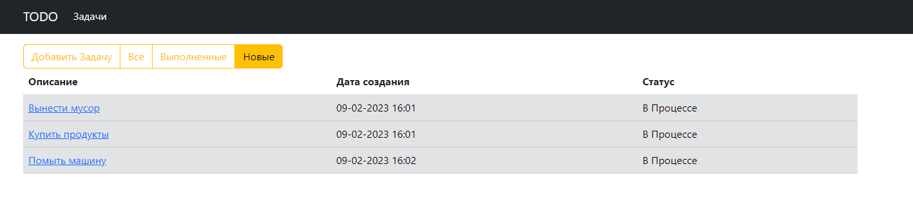

# Job4j_TODO

## Описание проекта
Приложение управление списком задач. Позволяет создавать, редактировать, удалять и просматривать статусы задач.

## Стек Технологий
+ **SPRING BOOT 2.7.6**
+ **HIBERNATE 5.6.12.FINAL**
+ **BOOTSTRAP 5**
+ **THYMELEAF 3.0.15**
+ **POSTGRESQL 14**
+ **LIQUIBASE 4.15.0**
+ **LOMBOK 1.18.22**

## Требования к окружению
+ **Java 17**
+ **Maven 4.0.0**
+ **Postgres 14**

## Запуск проекта

Создать базу данных с названием todo
```
create database todo;
```

Заменить данные подключения к БД.
Хранятся по пути src/main/resources/hibernate.cfg.xml
```
 <property name="hibernate.connection.driver_class">org.postgresql.Driver</property>
 <property name="hibernate.connection.url">jdbc:postgresql://127.0.0.1:5432/todo</property>
 <property name="hibernate.connection.username">postgres</property>
 <property name="hibernate.connection.password">password</property>
```

В Настроках Liquibase данные подключения к БД заменить на свои
Хранятся по пути db/liquibase.properties
```
changelogFile: db/dbchangelog.xml
url: jdbc:postgresql://localhost:5432/todo
username: postgres
password: password
driver-class-name=org.postgresql.Driver
```

Выполнить инструкции из корня проекта
```
mvn clean install
mvn spring-boot:run
```

## Взаимодействие с приложением
**Список задач**


**Выполненные задачи**


**Новые Задачи**


**Редактирование задачи**


**Форма редактирования зачади**


**Добавление новой задачи**


